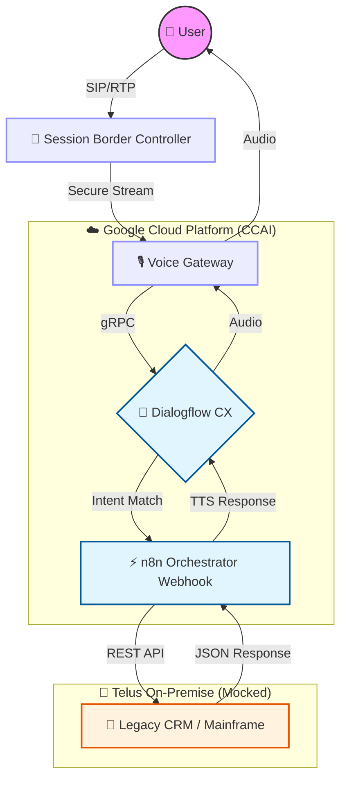

# 🚀 CCAI Ops Hub | Initiative AuraLink

**NeuralCodeLab Operations Center**: Centralized repository for orchestration, documentation, and deployment scripts for the **GenC** migration initiative under the AuraLink architecture.

> ⚠️ **SIMULATION ENVIRONMENT**  
> This repository is configured as a **Sandbox / Simulation Environment** to validate n8n orchestration logic and Dialogflow CX flows before promotion to **Staging** within Telus Canada.

---

## 📑 Navigation Index

| 📂 Section | 📝 Description | 🔗 Quick Access |
| :--- | :--- | :--- |
| **Documentation** | Deployment guides, APIs, and KEDBs | `/docs` |
| **Architecture** | IVR flow and topology diagrams | `/diagrams` |
| **Scripts** | Python / Bash operational tooling | `/scripts` |
| **Team & Data** | Sprint assignments and metadata | `/data` |

---

## 🧠 Project Vision (AuraLink)

**AuraLink** aims to modernize the Customer Interaction (CX) layer by migrating from legacy on‑premise solutions to a **hybrid cloud, AI‑powered architecture**.

### Key Objectives

- **Latency Reduction** – Optimized SBC ↔ Google Cloud handshake  
- **Omnichannel CX** – Voice and text unified under a single Dialogflow CX graph  
- **L3 Automation** – Self‑healing workflows via n8n webhooks  

---

## 🏗️ Solution Architecture (Simulated)

High‑level representation of an inbound interaction within the GenC ecosystem.

---

## ✅ System Requirements (Simulator Prep)

### Technical Prerequisites

- **Languages**
  - Python 3.9+
  - Node.js 18+
- **Simulation**
  - Docker
  - Docker Compose (local n8n instance)
- **Cloud Access**
  - Google Cloud Service Account Key (JSON) for Dialogflow CX Sandbox project
- **Network**
  - Active VPN (GlobalProtect) to reach mocked Telus endpoints

---

## 📊 Functional Requirements (KPIs)

- **Containment Rate**: > 45% (initial phase)  
- **Latency (STT/TTS)**: < 800 ms  
- **Availability**: 99.9% (High Availability target)  

---

## 📅 Roadmap & Lifecycle

Estimated execution timeline: **12 months**, divided into four strategic phases.

| Phase | Q1 (Jan–Mar) | Q2 (Apr–Jun) | Q3 (Jul–Sep) | Q4 (Oct–Dec) |
| :--- | :--- | :--- | :--- | :--- |
| Discovery | 🟢 Completed | | | |
| Development | | 🟡 In Progress | | |
| UAT / QA | | | 🔵 Planned | 🔵 Planned |
| Go‑Live | | | | 🚀 Launch |

---

## 🛡️ Governance & Team

### Project Prime

**Role**: Final authority for technical architecture and operational delivery.

- **Name**: DevLewiso  
- **Title**: Senior Architect – CCAI Strategist  
- **Contact**: neuralcodelab@internal.telus.com  
- **Responsibilities**:
  - PR approvals to `main`
  - Cloud topology definition
  - Stakeholder management

### Core Contributors

- **Ana (Lead)** – Solution Architecture  
- **Carlos (Dev)** – Backend Integrations (n8n)  
- **Jorge (Ops)** – CI/CD & Infrastructure  

---

## 📌 Notes

- This repository is **not production‑ready**.
- All integrations are **mocked or sandboxed**.
- No customer data is processed in this environment.

---

**© NeuralCodeLab | AuraLink Initiative – Simulation Repository**
